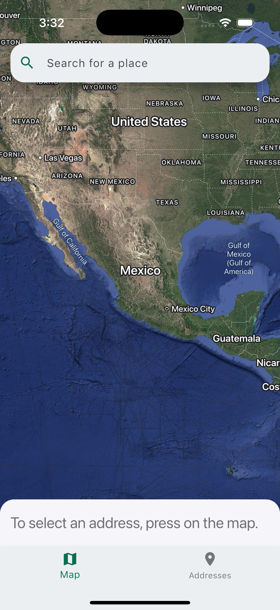
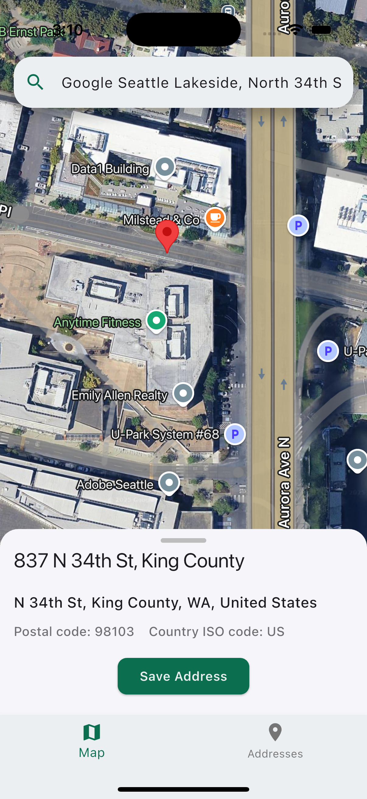
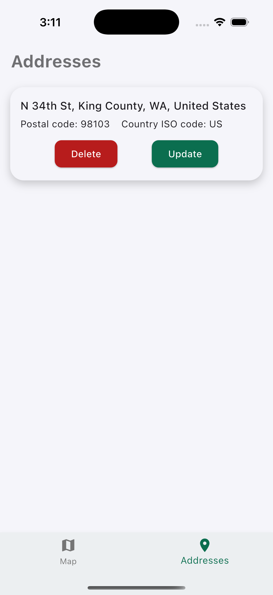

# Flutter Maps App

A Flutter application that allows users to search for places using the Google Places API. The app provides real-time autocomplete suggestions and detailed information about the selected place.

## Features

1. Live search with Google Places Autocomplete  
2. Fetch and display place details  
3. Save addresses in local storage 
4. Built using Flutter and Dart  

## Screenshots

<p>
  
  
  
</p>

## Tech Stack

### 🛠️ Core Technologies

- **[Flutter](https://flutter.dev/)** – UI toolkit for building natively compiled applications across mobile, web, and desktop from a single codebase.
- **[Dart](https://dart.dev/)** – Programming language optimized for building fast, multi-platform apps.

### 🌐 APIs & Services

- **[Google Places API](https://developers.google.com/maps/documentation/places/web-service/overview)** – Used for place autocomplete and place details search functionality.

### 📦 Dependencies

- **[`google_maps_flutter`](https://pub.dev/packages/google_maps_flutter)** – To embed and interact with Google Maps directly inside the Flutter app.
- **[`geocoding`](https://pub.dev/packages/geocoding)** – For converting addresses into geographic coordinates and vice versa.
- **[`geolocator`](https://pub.dev/packages/geolocator)** – To retrieve the current location of the device with high accuracy.
- **[`sqflite`](https://pub.dev/packages/sqflite)** – SQLite plugin for Flutter to store structured local data efficiently.
- **[`flutter_riverpod`](https://pub.dev/packages/flutter_riverpod)** – State management solution that helps structure and scale Flutter apps with reactive programming.
- **[`http`](https://pub.dev/packages/http)** – For making HTTP requests to the Google Places API.
- **[`path`](https://pub.dev/packages/path)** – Provides utilities for manipulating file system paths in a cross-platform way.
- **[`path_provider`](https://pub.dev/packages/path_provider)** – Used to find commonly used locations on the filesystem (like temp or documents directory).
- **[`fluttertoast`](https://pub.dev/packages/fluttertoast)** – To display toast messages for short, unobtrusive user feedback.
- **[`flutter_dotenv`](https://pub.dev/packages/flutter_dotenv)** – To manage API keys securely using environment variables.

## Getting Started

Follow these steps to run the project locally:

### 1. Clone the repository

```bash
git clone https://github.com/your-username/flutter-map-app.git
cd flutter-map-app
```

### 2. Install dependencies

```bash
flutter pub get
```

### 3. Set up environment variables

You can use the provided `.env.example` as a reference.

1. Create a `.env` file in the root directory and add your API key:

```env
GOOGLE_API_KEY=your_google_api_key_here
```
(Get your own API key from the [Google Cloud Console](https://console.cloud.google.com/)).


2. Finally add your API key in the following files:
[AppDelegate.swift](ios/Runner/AppDelegate.swift) and
[AndroidManifest.xml](android/app/src/main/AndroidManifest.xml)


### 4. Run the app

```bash
flutter run
```

## Notes

- This project is for educational and portfolio purposes.
- The actual API key is not included in this repository.

## License

This project is licensed under the [MIT License](LICENSE).

---

Built using Flutter by [Emiliano Angel](https://github.com/EmilianoAngelJ)
